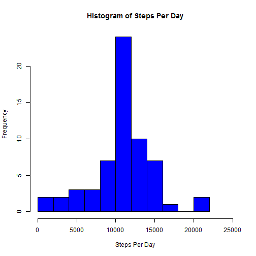

###Loading the Data
This assignment is a report of data input from a personal activity monitoring device.  The raw data file was "repdata-data-activity.zip" and was dowloaded from the following link:

https://d396qusza40orc.cloudfront.net/repdata%2Fdata%2Factivity.zip

When uncompressed, the zip archive contained one file, called "activity.csv"

The following code was used to read in the data into R:


```r
rawdata <- read.csv("activity.csv")
```

The variables included were:  
- steps: this is the count of steps recorded during a 5-minute interval.  
- date: this is the date of the recording.  
- interval: this is the identifier for the 5-minute interval.  

###What is mean total number of steps taken per day?
The following code calculates the total number of steps per day:


```r
stepsperday <- tapply(rawdata$steps,rawdata$date,sum)
```

Looking at the total steps per day, a simple histogram can tell part of the story:

```r
hist(stepsperday, xlim = c(0,25000), breaks = 10, 
         col = "BLUE", xlab = "Steps Per Day", 
         main = "Histogram of Steps Per Day")
```

 

The steps per day data has the following mean and median:

```r
mean(stepsperday, na.rm = TRUE)
```

```
## [1] 10766.19
```

```r
median(stepsperday, na.rm = TRUE)
```

```
## [1] 10765
```

###What is the average daily activity pattern?
A time series plot of the 5-minute intervals can show the overall activity throughout the day:

```r
stepsperint <- as.numeric(tapply(rawdata$steps,rawdata$interval,mean, na.rm = TRUE))

plotdata <- cbind.data.frame(unique(rawdata$interval),stepsperint)

# Sets the names for the axes, as per the assignment instructions.
names(plotdata) <- c("X", "Y")

plot(plotdata$X,plotdata$Y,
     type = "l", 
     main = "Average Daily Activity Pattern",
     xlab = "5-Minute Interval", 
     ylab = "Average Number of Steps",
     lwd = 1)
```

 

The plot clearly shows a spike in steps at approximately 8:00 am.  The following code determined the actual peak step interval:

```r
plotdata[plotdata$Y == max(plotdata$Y),1]
```

```
## [1] 835
```
Running the code determines 8:35am interval to have the peak quantity of steps, on average.

###Imputing missing values
The original data set contains quite a few NAs:

```r
sum(is.na(rawdata$steps) == TRUE)
```

```
## [1] 2304
```

My strategy for dealing with the NA values is to replace al NAs with the overall mean for that 5-minute interval, creating a new data set:

```r
cleandata <- rawdata
    
for(i in 1:nrow(rawdata)) {
    
    if(is.na(cleandata[i,1]) == TRUE) {
            int <- cleandata[i,3]
            cleandata[i,1] <- plotdata[plotdata$X == int, 2]  }
}

cleanstepsperday <- tapply(cleandata$steps,cleandata$date,sum)
```

This histogram shows a change from the original data:

```r
hist(cleanstepsperday, 
    xlim = c(0,25000), 
    breaks = 10, 
    col = "BLUE", 
    xlab = "Steps Per Day", 
    main = "Histogram of Steps Per Day")
```

 

```r
mean(cleanstepsperday, na.rm = TRUE)
```

```
## [1] 10766.19
```

```r
median(cleanstepsperday, na.rm = TRUE)
```

```
## [1] 10766.19
```

The effect of clearing out the NAs was fairly minimal.  The mean of the data did not change, while the median shifted slightly.  

###Are there differences in activity patterns between weekdays and weekends?
It's likely that our activity levels may differ between weekdays and weekends.  The following code classifies the data accordingly and plots it:

```r
#Create a new data set from the cleaned up data set.
datedata <- cleandata
    
#Convert dates from factors to date format.
datedata$date <- as.Date(datedata$date)
    
#create day of week vector, then convert to indicate weekend or weekday.
dayofweek <- weekdays(datedata$date)
    
for(i in 1:length(dayofweek)) {
    if(dayofweek[i] == "Saturday" | dayofweek[i] == "Sunday") {
        dayofweek[i] <- "Weekend"} else {
        dayofweek[i] <- "Weekday"  }
    }

#Add day of week information to the data set.
datedata <- cbind(datedata,dayofweek)

#Break up the data sets for independent analysis.
WDdata <- datedata[datedata$dayofweek == "Weekday",]
WEdata <- datedata[datedata$dayofweek == "Weekend",]

#Analyze means of weekday data.
WDstepsperint <- as.numeric(tapply(WDdata$steps,WDdata$interval,mean))
WDplotdata <- cbind.data.frame(unique(rawdata$interval),WDstepsperint,rep("Weekday",length(WDstepsperint)))
names(WDplotdata) <- c("X", "Y", "Weekend")

#Analyze means of weekday data.
WEstepsperint <- as.numeric(tapply(WEdata$steps,WEdata$interval,mean))
WEplotdata <- cbind.data.frame(unique(rawdata$interval),WEstepsperint,rep("Weekend", length(WEstepsperint)))
names(WEplotdata) <- c("X", "Y","Weekend")

#Combine WE and WD data into one set.
intervaldata <- rbind(WDplotdata,WEplotdata)
names(intervaldata) <- c("Interval","Steps", "Weekend")

#Using lattice system to plot the data.
library(lattice)
xyplot(Steps ~ Interval | Weekend, data = intervaldata, type = "l",layout = c(1, 2))
```

 

As shown in the graph, there is a difference in activity between weekends and weekdays.

Thanks for reading this report!
